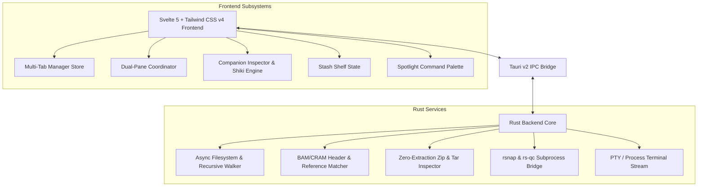

<div align="center">

# ⚡ Flashbrowse (Tauri v2)

### The ultra-fast, cross-platform file manager & bioinformatics command center

[](https://github.com/olawa/flashbrowse-tauri)
[](https://tauri.app)
[](https://www.rust-lang.org)
[](https://svelte.dev)
[](https://github.com/olawa/flashbrowse-tauri/releases)
[](LICENSE)

<br />

*Rust Backend • Svelte 5 + SvelteKit Frontend • Multi-Tab & Dual-Pane • Multi-Monitor Inspector • Native Bioinf Tools*

<br />

[**📥 Download Latest Release (v0.2.0)**](https://github.com/olawa/flashbrowse-tauri/releases/latest) • [**✨ Features**](#-key-features) • [**🧬 Bioinformatics**](#-bioinformatics-command-center) • [**⌨️ Keyboard Cheatsheet**](#️-keyboard-shortcuts) • [**🛠️ Build from Source**](#️-building-from-source)

</div>

---

## 💡 Why Flashbrowse Tauri?

Traditional file browsers are sluggish, memory-heavy, and completely disconnected from modern bioinformatics pipelines and developer terminal workflows. 

**Flashbrowse Tauri** combines the raw speed and memory safety of **Rust** with the reactive responsiveness of **Svelte 5** and **Tauri v2** to deliver a lightweight (~3.2 MB DMG), blazing-fast file browser tailored for data scientists, bioinformaticians, and power users.

| Feature | Standard File Manager | ⚡ Flashbrowse Tauri |
| :--- | :--- | :--- |
| **Tabbed Browsing** | Basic or none | **Full multi-tab workspace with `Cmd+T`, `Cmd+W`, drag reorder** |
| **Dual-Pane Commander** | Separate app required | **Built-in Dual-Pane (`F3` / `Cmd+D`) with Norton Commander keys** |
| **Genomics & Alignments** | Generic file icons | **BAM header inspector, auto-reference matching, live `rsnap` & `rs-qc`** |
| **Companion Inspector** | Single-window preview | **Detached multi-monitor live window with bidirectional sync** |
| **Archive Inspection** | Must unpack archive | **Zero-extraction `.zip` / `.tar.gz` archive inspector** |
| **Staging & Collecting** | Single clipboard copy | **Stash Shelf drawer (`Cmd+Shift+S`) to collect files across folders** |
| **Syntax Highlighting** | Plain text / uncolored | **Offline VS Code Shiki engine (100+ languages & dark themes)** |
| **Search & Filtering** | Slow indexing search | **Instant wildcard glob matching (`*.bam, *.vcf`) + fuzzy Command Palette** |
| **Integrated Terminal** | Separate terminal app | **Built-in terminal drawer (`Cmd+J`) with 2-way live directory sync** |

---

## ✨ Key Features

### 📑 1. Multi-Tab Navigation
- Open unlimited independent browsing tabs with **`Cmd + T`** and close with **`Cmd + W`**.
- Switch tabs quickly using **`Cmd + 1..9`** or **`Cmd + Shift + [`** / **`Cmd + Shift + ]`**.
- Each tab preserves its own folder history, scroll position, search query, and view mode.

---

### 🧬 2. Bioinformatics Command Center
- **BAM / CRAM Header Inspector**:
  - Automatically parses `@HD`, `@SQ` (reference contigs & lengths), `@RG` (read groups, sample names), and `@PG` (command lines, alignment tools).
  - **Automated Reference Matching**: Identifies matching reference genomes (`hg38`, `GRCh38`, `hg19`, `chm13_v2`, `mm10`, `mm39`) by comparing contig checksums and length distributions.
- **Live `rsnap` Locus Snapshotting**:
  - Enter a genomic region (e.g. `chr7:55140000-55160000` or `EGFR`) and render high-resolution alignment snapshot images directly within the inspector without leaving the app.
  - Automatically locates local reference FASTA genomes matching the detected header.
- **`rs-qc` Alignment QC Runner**:
  - Right-click any BAM or CRAM file to trigger `rs-qc align` with real-time terminal output.
- **File Type Index Hub**:
  - Sidebar indexer groups all genomics files (`.bam`, `.cram`, `.vcf`, `.fastq`, `.bed`, `.gtf`) in the current tree into master-detail split views.

---

### 🖥️ 3. Multi-Monitor Detached Live Inspector (`Cmd + Option + I`)
Detach the inspector into a standalone window and place it on an external display or iPad:
- **Bidirectional Live Synchronization**: Selecting or hovering over files in the main window updates the detached inspector in real-time.
- **Rich Document Rendering**:
  - **Code & Config**: Offline VS Code syntax highlighting with Shiki.
  - **Markdown (`.md`)**: Rendered HTML preview with GitHub theme or source code view.
  - **Spreadsheets (`.csv`, `.tsv`, `.xlsx`)**: Interactive dark table grid with sortable columns and text filtering.
  - **Images & Photos**: High-performance photo viewer with **Culler mode** (Swipe/Space to Keep in `_picked`, Delete to Discard).
  - **PDF & Media**: Built-in PDF reader and audio/video player.

---

### 📦 4. Zero-Extraction Archive Inspector
- Select any `.zip`, `.tar.gz`, or `.tgz` archive to inspect its internal directory tree and file listings without extracting them to disk.

---

### 📥 5. Stash Shelf Drawer (`Cmd + Shift + S`)
- A slide-up bottom shelf where you can drag and drop or stage files from multiple different directories.
- Perform batch operations on all stashed items at once: *Batch Copy*, *Batch Move*, *Batch Rename*, *Clear*, or *Run Command*.

---

### ◫ 6. Classic Dual-Pane Commander (`F3` / `Cmd + D`)
- Side-by-side dual browser panes.
- Traditional Norton Commander keyboard controls:
  - **`F3`**: View / Inspect
  - **`F4`**: Edit
  - **`F5`**: Copy to opposite pane
  - **`F6`**: Move to opposite pane
  - **`F7`**: New folder
  - **`F8`**: Delete / Move to trash
  - **`Tab`**: Switch active pane

---

### 🔍 7. Wildcard Filtering & Command Palette (`Cmd + K`)
- **Wildcard Filter Bar**: Filter file lists using glob patterns:
  - `*.bam` $\rightarrow$ shows only BAM files.
  - `*sample*_R1*` $\rightarrow$ matches forward reads.
  - `*.vcf, *.bed` $\rightarrow$ multi-pattern matching.
- **Spotlight Command Palette (`Cmd + K`)**: Fuzzy search actions, workspaces, bookmarks, and recent locations.

---

## ⌨️ Keyboard Shortcuts

| Shortcut | Action |
| :--- | :--- |
| **`Cmd + T`** | Open new browser tab |
| **`Cmd + W`** | Close current tab |
| **`Cmd + 1..9`** | Switch to tab 1..9 |
| **`Cmd + Shift + [` / `]`** | Switch to previous / next tab |
| **`Cmd + D`** / **`F3`** | Toggle Dual-Pane Split View |
| **`Tab`** | Toggle active pane in dual-pane mode |
| **`Cmd + Option + I`** | Detach / Attach Companion Inspector |
| **`Cmd + J`** | Toggle Integrated Terminal Drawer |
| **`Cmd + Shift + S`** | Toggle Stash Shelf Drawer |
| **`Cmd + K`** / **`Cmd + P`** | Open Command Palette |
| **`Cmd + L`** | Jump to path input / breadcrumb bar |
| **`Cmd + Shift + .`** | Toggle hidden dotfiles |
| **`Cmd + Shift + R`** | Open Batch Rename Dialog |
| **`Cmd + V`** | Paste clipboard as image/text file |
| **`Space`** | Open QuickLook preview |
| **`Return`** | Open file or drill into directory |
| **`F5`** | Copy selected files to opposite pane |
| **`F6`** | Move selected files to opposite pane |
| **`F7`** | Create new folder |
| **`F8`** | Move selected files to trash |

---

## 📥 Installation

1. Download the latest **`Flashbrowse_0.2.0_aarch64.dmg`** from [GitHub Releases](https://github.com/olawa/flashbrowse-tauri/releases/latest).
2. Open the `.dmg` and drag **Flashbrowse** to your `/Applications` folder.
3. **First launch on macOS (Gatekeeper notice)**:
   Since Flashbrowse is an independent open-source project without a paid Apple Developer certificate, macOS Gatekeeper may flag downloaded binaries as *"damaged"* (`com.apple.quarantine`). 
   To clear the quarantine flag, run this command once in Terminal:
   ```bash
   xattr -cr /Applications/Flashbrowse.app
   ```
   *Alternatively*: Right-click `Flashbrowse.app` in Finder $\rightarrow$ hold `Option` $\rightarrow$ click **Open** $\rightarrow$ confirm **Open Anyway** in *System Settings > Privacy & Security*.
4. Launch **Flashbrowse**!

---

## 🛠️ Building from Source

### Prerequisites
- **Node.js**: 18+ and `npm`
- **Rust**: 1.75+ (`curl --proto '=https' --tlsv1.2 -sSf https://sh.rustup.rs | sh`)
- **macOS Build Tools**: Xcode Command Line Tools (`xcode-select --install`)

### Build Steps

```bash
# 1. Clone repository
git clone https://github.com/olawa/flashbrowse-tauri.git
cd flashbrowse-tauri

# 2. Install frontend dependencies
npm install

# 3. Run in Development Mode
npm run tauri dev

# 4. Build Production Release Bundle (DMG + App)
npm run tauri build
```

The production DMG and `.app` will be created in `src-tauri/target/release/bundle/dmg/`.

---

## 🏗️ Architecture



---

## 📄 License

Distributed under the **MIT License**. See `LICENSE` for details.
